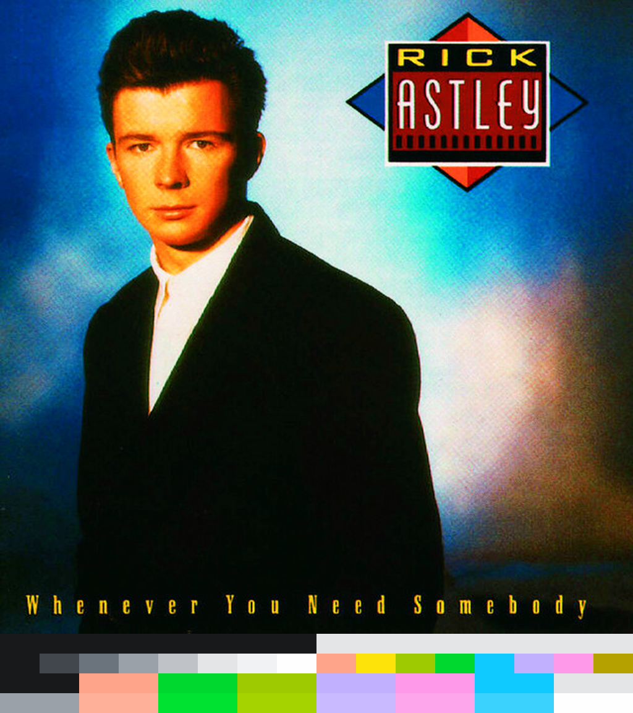

# ColorGen: [Base16](https://github.com/chriskempson/base16) schemes generator

A color scheme generator for [Base16](https://github.com/chriskempson/base16).

[It is written in rust
btw](https://www.reddit.com/r/linuxmemes/comments/9xgfxq/why_i_use_arch_btw/).

## Screenshots



- [Source](https://open.spotify.com/track/7GhIk7Il098yCjg4BQjzvb)

## Installation

```sh
cargo install --path .
```

## Usage

```
Usage: colorgen [OPTIONS] <IMAGE>

Arguments:
  <IMAGE>

Options:
      --appearance <APPEARANCE>
          [default: darker] [possible values: darkest, darker, dark, light, lighter, lightest]
      --kappa-1 <KAPPA_1>
          Kappa parameter of the von Mises distribution for hue. The higher the value, the more weight will be given to hues concentrated around the primary hues: 0, 30 (orange), 60, 120, 180, 240, 300 [default: 5.0]
      --kappa-2 <KAPPA_2>
          Kappa parameter of the von Mises distribution for saturation and lightness. The higher the value, the more weight will be given to the saturation and lightness of colors with similar hue [default: 10.0]
      --tau <TAU>
          Tau parameter for the softmax function. The higher the value, the more uniform the weights will be [default: 0.05]
      --wcag-level <WCAG_LEVEL>
          [default: aaa] [possible values: aa, aaa]
      --minimum-chroma <MINIMUM_CHROMA>
          [default: 0.2]
      --maximum-background-chroma <MAXIMUM_BACKGROUND_CHROMA>
          [default: 0.2]
      --debug

      --debug-output <DEBUG_OUTPUT>

  -h, --help
          Print help
  -V, --version
          Print version
```

## Links

- [GitHub](https://github.com/cdltlehf/colorgen)
